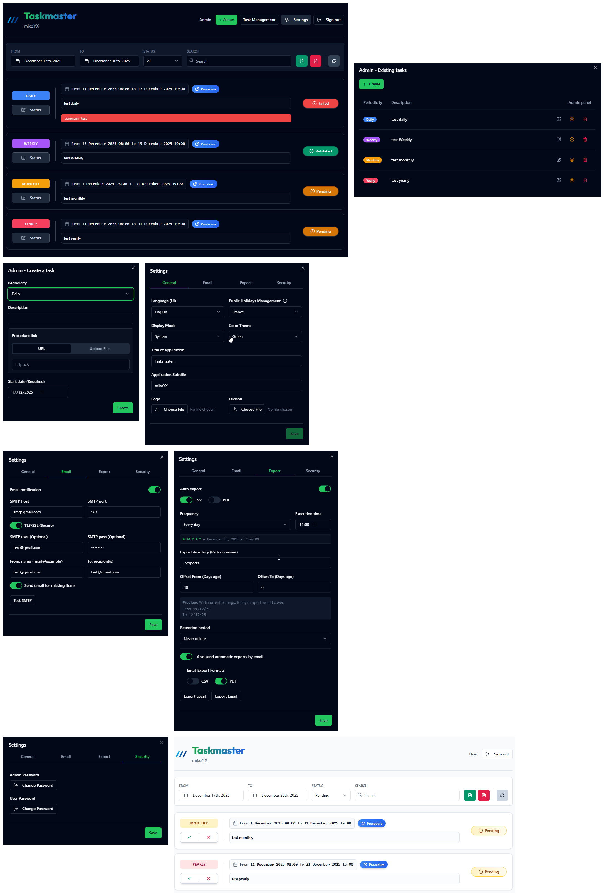

# Taskmaster App

A modern, robust task management application designed for tracking periodic checklists (daily, weekly, monthly). Built with Node.js, SQLite, and a React frontend using Vite and Shadcn/UI.



## ✨ New Features in 2.0

Comprehensive update focus on automation, security, and data analytics:

- **Enterprise Authentication**: Support for **LDAP** and **Microsoft Azure AD** (OIDC) for centralized user management.
- **Advanced Dashboard**: Real-time analytics with interactive charts, performance tracking, and status breakdown.
- **Professional Reporting**: High-end, responsive HTML templates for automated export emails.
- **Granular Email Controls**: Choose exactly who receives automated reports (Admins, Custom lists, or both).
- **Intelligent Backups**: Configurable retention policies with automated rotation, manual **JSON/ZIP export/import**, and **optional encryption** for enhanced security. Supports including local files (logos, procedures).
- **Task Delegation**: Seamlessly delegate tasks to other users for specific periods, ensuring workflow continuity during absences.
- **Enhanced Filtering & Presets**: Save complex filter sets as presets for rapid, one-click exports with advanced criteria.
- **Smart Recipient Groups**: Automatic targeting of admin users with email addresses for critical notifications.
- **Real-time Configuration Testing**: Instantly test SMTP and Export settings using current UI state.

## 🚀 Features

- **Periodic Tasks**: Manage tasks with specific frequencies (Daily, Weekly, Monthly).
- **Status Tracking**: Validate, Fail, or mark tasks as Missing. 
- **Comments**: Add mandatory comments for failed tasks.
- **Visual Analytics**: Interactive dashboard with Pie Charts (Status Breakdown) and Bar Charts.
- **PDF & CSV Export**: Generate detailed reports with automatic formatting and visual statistics.
- **Email Notifications**: Automated email reports via SMTP.
- **Modern UI**: Clean, responsive interface built with Shadcn/UI and Tailwind CSS.
- **Dark Mode**: Fully supported dark/light theme toggling.

## 🛠️ Tech Stack

- **Backend**: Node.js, Express, SQLite3
- **Frontend**: React 19, Vite, Tailwind CSS, Shadcn/UI
- **Services**: Nodemailer (Email), PDFKit (Reporting), Node-Cron (Scheduling)

## 📦 Installation

### Prerequisites
- Node.js (v20 or higher)
- npm or yarn

### Steps

1. **Clone the repository**
   ```bash
   git clone https://github.com/mikaYX/taskmaster.git
   cd taskmaster
   ```

2. **Install Backend Dependencies**
   ```bash
   npm install
   ```

3. **Install Frontend Dependencies**
   ```bash
   cd client
   npm install
   cd ..
   ```
## 🚀 Production

To build and run the application for production usage:

1. **Build the Frontend**
   ```bash
   npm run build
   ```
   *This compiles the React app into `client/dist`.*

2. **Start the Server**
   ```bash
   npm run server
   ```
   *The application will be available at **http://localhost:3000**.*

## 💻 Development

To run the application in development mode (with hot-reloading for React):

```bash
npm run dev
```
*   **Frontend**: http://localhost:5173
*   **Backend API**: http://localhost:3000

## ⚙️ Configuration

The application includes a built-in **Settings** interface accessible via the gear icon in the UI.

- **General**: Title, Subtitle, Theme, Country (for holidays).
- **Email**: SMTP server settings for notifications.
- **Export**: Auto-export schedules and retention policies.
- **Files**: Upload custom Logo and Favicon.

## 📂 Project Structure

- `server.js` - Main backend entry point.
- `src/` - Backend logic (Controllers, Models, Services).
- `client/` - Frontend React application.
- `data/` - SQLite database storage.
- `exports/` - Generated PDF/CSV reports.

## Support / Donate

If you like this project and want to support it:<br>  

[](https://buymeacoffee.com/mikaxy)