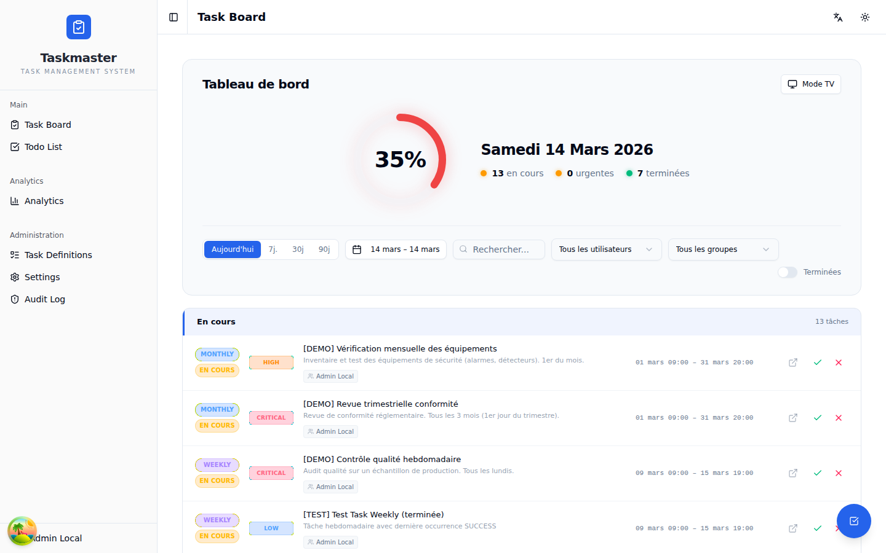
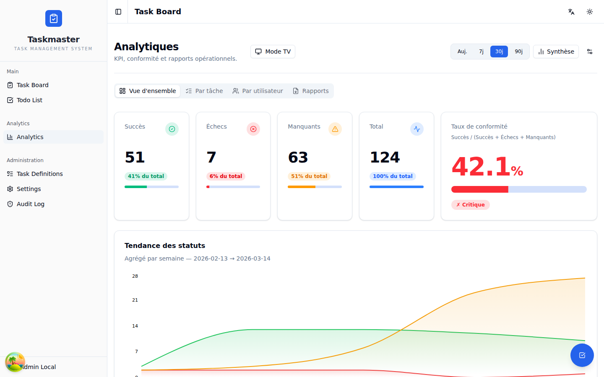
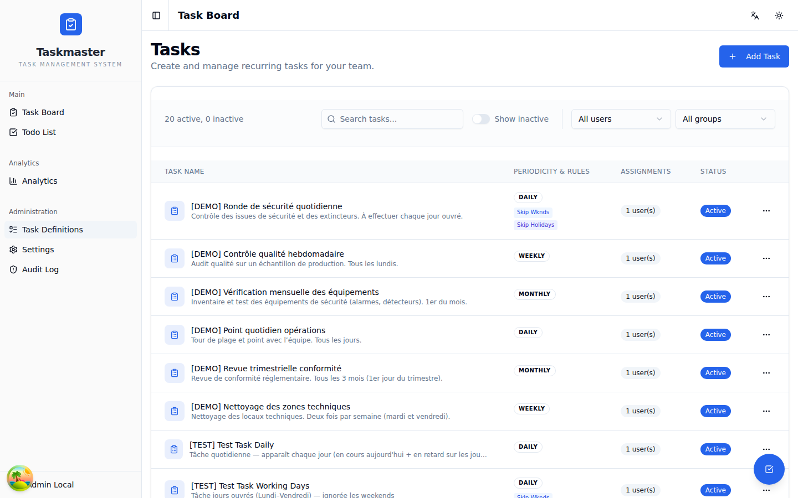
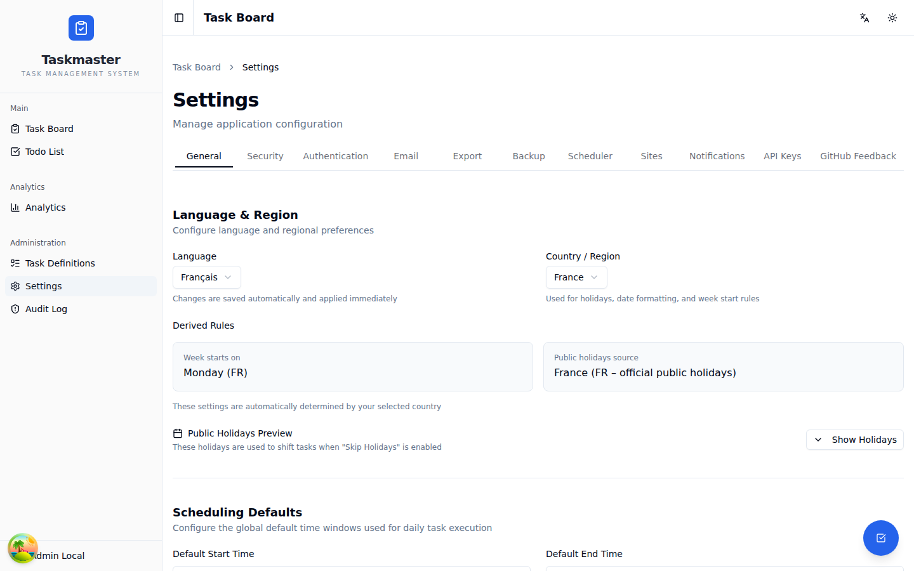

# Taskmaster

**Gestion de tâches périodiques pour les équipes opérationnelles.**

Taskmaster est une application web open source conçue pour les organisations qui ont besoin de tracer, planifier et valider des tâches récurrentes : rondes de sécurité, vérifications techniques, procédures métier, contrôles qualité. L'interface est pensée pour une utilisation quotidienne sur le terrain, en salle de contrôle ou depuis un bureau.

---

## Pourquoi Taskmaster

La plupart des outils de gestion de tâches sont pensés pour des équipes de développement. Taskmaster part d'un autre besoin : des organisations qui ont des **tâches périodiques critiques** à tracer — chaque jour, chaque semaine, chaque mois — et qui ont besoin d'un tableau de bord opérationnel clair, d'une traçabilité fiable et d'un historique exploitable.

- Les tâches sont définies une fois, puis générées automatiquement selon leur planification
- Chaque occurrence est assignée, validée ou escaladée en temps réel
- Les managers voient l'état global de leur équipe en un coup d'œil
- Les administrateurs contrôlent finement les accès, les sites et les intégrations

---

## Aperçu de l'interface

### Tableau de bord opérationnel
Le cœur de l'application : toutes les tâches du jour, regroupées par statut, filtrables par utilisateur, groupe ou site. Mode TV disponible pour affichage mural.



### Analytiques et conformité
Taux de complétion, tendances sur 1 à 90 jours, performance par tâche et par utilisateur. Export CSV ou PDF intégré.



### Bibliothèque de tâches
Définition des tâches, configuration des planifications (quotidien, hebdomadaire, mensuel, règles RRULE personnalisées), gestion des procédures attachées.



### Paramètres et intégrations
Configuration des authentifications (SSO, LDAP, OIDC, SAML…), des notifications, des sauvegardes et de l'identité de l'organisation.



---

## Fonctionnalités principales

**Opérationnel**
- Tableau de bord temps réel avec filtres (utilisateur, groupe, site, date)
- Statuts granulaires : en attente, complété, en retard, manquant, escaladé
- Mode TV pour affichage mural en salle de contrôle
- Todo list personnelle et collective
- Recherche et filtres avancés sur toutes les vues

**Planification**
- Tâches périodiques : quotidien, hebdomadaire, mensuel, annuel ou règles RRULE personnalisées
- Gestion des jours fériés et des week-ends
- Fenêtres de complétion configurables
- Mode "depuis la dernière complétion" pour les cycles dynamiques
- Délégation de tâches entre utilisateurs

**Organisation**
- Gestion multi-sites avec hiérarchie de sites
- Groupes d'utilisateurs et affectations collectives
- Rôles : Super Admin, Admin, Manager, Utilisateur, Invité (lecture seule)
- Journal d'audit complet de toutes les actions

**Authentification et sécurité**
- Authentification locale avec JWT + rotation des tokens
- LDAP / Active Directory
- Google OAuth, Azure AD / Microsoft Entra ID
- OIDC et SAML 2.0
- Authentification multi-facteurs (TOTP) et passkeys (WebAuthn)
- Clés API pour intégrations externes
- Chiffrement des données sensibles au repos

**Notifications et exports**
- Alertes email (SMTP, SendGrid, Mailgun, Mailjet)
- Notifications web push
- Export CSV et PDF des rapports analytiques
- Sauvegardes automatisées avec chiffrement

---

## Pour qui

| Profil | Ce que Taskmaster apporte |
|---|---|
| **Responsable opérationnel** | Visibilité temps réel sur l'avancement des tâches de son équipe |
| **Agent ou technicien** | Interface claire pour valider ses tâches du jour, sans friction |
| **Administrateur IT** | Gestion centralisée des accès, SSO, audit, sauvegardes |
| **Développeur** | Codebase TypeScript structuré, API documentée, stack standard |

---

## Stack technique

| Couche | Technologie |
|---|---|
| **Frontend** | React 19, Vite, Tailwind CSS, shadcn/ui, Tanstack Query, Zustand |
| **Backend** | NestJS, Prisma ORM, PostgreSQL, Redis, BullMQ |
| **Auth** | Passport.js, JWT, LDAP, OIDC, SAML, WebAuthn |
| **Observabilité** | OpenTelemetry, Prometheus, Pino |
| **Déploiement** | Docker, image fullstack unique (API + SPA) |

Monorepo npm workspaces. TypeScript end-to-end. Tests unitaires sur backend et frontend.

---

## Démarrage rapide

**Avec Docker (recommandé)**

```bash
cp .env.docker.example .env
# Éditer .env pour définir les secrets
docker compose up -d
```

L'application sera disponible sur `http://localhost:3000`. Un assistant de configuration guidera la création du premier compte administrateur.

**En développement local**

```bash
npm install
docker compose -f docker-compose.local-db.yml up -d  # PostgreSQL + Redis
cd backend && npx prisma migrate deploy && cd ..
npm run dev
```

- Backend : `http://localhost:3000`
- Frontend : `http://localhost:5173`

→ Guide complet : [`QUICKSTART.md`](QUICKSTART.md) · [`SETUP.md`](SETUP.md)

---

## Documentation

| Document | Contenu |
|---|---|
| [`QUICKSTART.md`](QUICKSTART.md) | Démarrage en 5 minutes |
| [`SETUP.md`](SETUP.md) | Installation détaillée |
| [`docs/user-guide.md`](docs/user-guide.md) | Guide utilisateur : valider une tâche, délégations, todos |
| [`docs/use-cases.md`](docs/use-cases.md) | Cas d’usage métier et exemples de planification |
| [`docs/authentication.md`](docs/authentication.md) | SSO, LDAP, OIDC, SAML, MFA |
| [`docs/local-db.md`](docs/local-db.md) | PostgreSQL et Redis en local |
| [`docs/DOCKER-BUILD.md`](docs/DOCKER-BUILD.md) | Build et publication Docker |
| [`docs/operations.md`](docs/operations.md) | Exploitation et administration |
| [`docs/troubleshooting.md`](docs/troubleshooting.md) | Dépannage |
| [`docs/incident_runbook.md`](docs/incident_runbook.md) | Runbook incident |

---

## Contribuer

Le projet est ouvert aux contributions. Le codebase est structuré en modules NestJS côté backend et en features React côté frontend, avec des conventions claires et une couverture de tests existante.

**Pour démarrer :**
1. Forker le dépôt et cloner localement
2. Suivre le guide [`SETUP.md`](SETUP.md) pour l'environnement de développement
3. Ouvrir une issue pour discuter d'une fonctionnalité ou d'un bug
4. Soumettre une pull request en respectant les conventions du projet

Les contributions peuvent porter sur des fonctionnalités, des corrections de bugs, des traductions, de la documentation ou des tests.

---

## Statut du projet

Le projet est en développement actif. L'interface principale, la gestion des tâches périodiques, l'authentification multi-provider et les analytiques sont fonctionnels et utilisés.

**Prochaines étapes envisagées :**
- Internationalisation complète (i18n en place, traductions à étendre)
- Intégrations tierces via webhooks
- Application mobile (PWA)

---

## Licence

Ce projet est distribué sous licence MIT. Voir [`LICENSE`](LICENSE) pour les détails.
